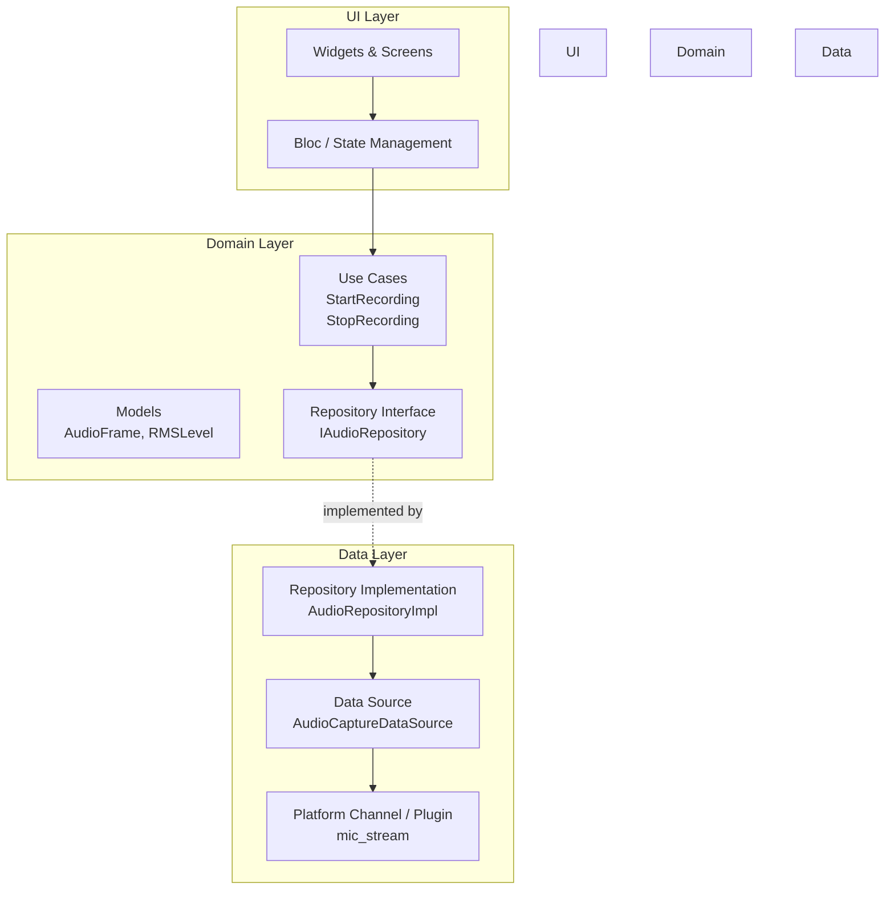
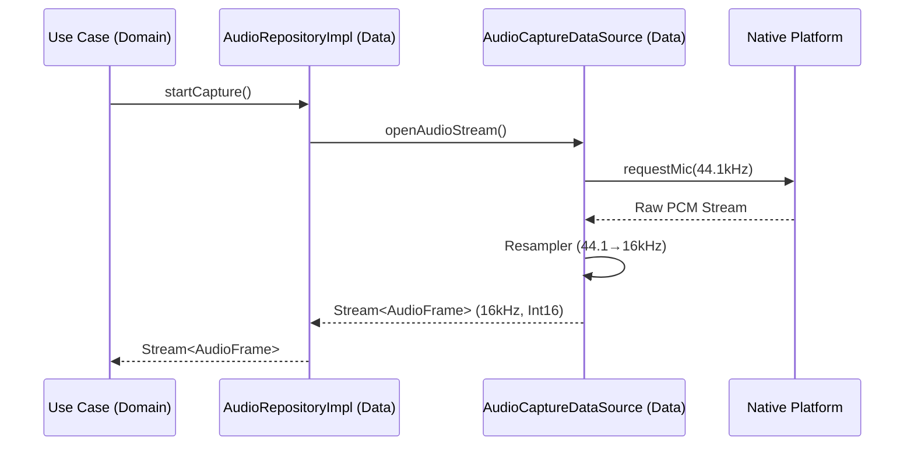
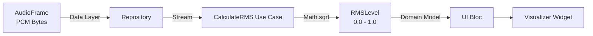
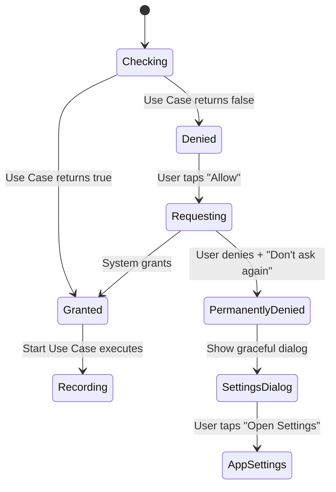

Based on the [Flutter Architecture Guide](https://docs.flutter.dev/app-architecture/guide), here is the **Layered Architecture** setup for implementing Audio Capture & Preprocessing (FR-001 to FR-004).

## Architectural Pattern: Layered Architecture (Official Flutter Guide)

The official Flutter documentation recommends a **Layered Architecture** with three distinct layers. Dependencies flow strictly in one direction: **UI Layer → Domain Layer → Data Layer**.



### Layer Responsibilities for Audio Feature

| Layer | Responsibility | FR Mapping |
|-------|---------------|------------|
| **UI Layer** | Manages permission dialogs (FR-004), displays visualizer, triggers recording actions | FR-004 (UI part) |
| **Domain Layer** | Defines `AudioFrame` model, `CalculateRMS` use case, repository contracts | FR-003 (Logic), FR-001 (Contract) |
| **Data Layer** | Implements actual microphone capture, resampling (44.1→16kHz), platform permission checks | FR-001, FR-002, FR-004 (System check) |

---

## Folder Structure

```text
lib/
├── main.dart
├── app.dart
├── src/
│   ├── core/
│   │   ├── constants/
│   │   │   └── audio_constants.dart      # Sample rates, buffer sizes
│   │   └── utils/
│   │       └── permission_handler.dart   # Wrapper for permission logic
│   │
│   └── features/
│       └── transcription/
│           ├── ui/                          # UI LAYER
│           │   ├── bloc/
│           │   │   ├── audio_cubit.dart     # Manages UI state + permission dialogs
│           │   │   └── audio_state.dart
│           │   ├── screens/
│           │   │   └── recorder_screen.dart
│           │   └── widgets/
│           │       ├── permission_request_widget.dart  # FR-004 UI
│           │       └── waveform_visualizer.dart        # Displays RMS (FR-003)
│           │
│           ├── domain/                      # DOMAIN LAYER
│           │   ├── models/
│           │   │   ├── audio_frame.dart     # PCM data + timestamp
│           │   │   └── rms_level.dart       # FR-003 data model
│           │   ├── repositories/
│           │   │   └── audio_repository.dart # Abstract interface
│           │   └── use_cases/
│           │       ├── start_recording.dart # Orchestrates permission + capture
│           │       ├── stop_recording.dart
│           │       └── calculate_rms.dart   # FR-003 Business logic
│           │
│           └── data/                        # DATA LAYER
│               ├── repositories/
│               │   └── audio_repository_impl.dart # Concrete implementation
│               └── datasources/
│                   ├── audio_capture_datasource.dart      # Abstract
│                   └── audio_capture_datasource_impl.dart # FR-001, FR-002 implementation
```

---

## Component Breakdown by Requirement

### FR-001 & FR-002: Capture & Resampling
**Location:** `data/datasources/audio_capture_datasource_impl.dart`

This is a **Data Source** in the Data Layer. It directly interfaces with the platform (using `mic_stream` or `flutter_sound`) and handles the technical conversion.



**Key Rule:** The Domain Layer only knows about `AudioFrame` (16kHz, Int16). It has no knowledge of whether the hardware originally captured at 44.1kHz or 48kHz. The resampling is an implementation detail hidden in the Data Layer.

### FR-003: RMS Calculation
**Location:** `domain/use_cases/calculate_rms.dart` (Domain Layer)

RMS calculation is **business logic** (how we interpret the audio for the visualizer), not just data retrieval. The Data Source provides raw PCM bytes, but the Use Case transforms them into a normalized 0.0-1.0 level.



### FR-004: Permission Management
**Location:** Split across layers

| Step | Layer | Component | Action |
|------|-------|-----------|--------|
| 1 | UI | `audio_cubit.dart` | Checks current permission status via `CheckPermissionUseCase` |
| 2 | Domain | `check_permission.dart` | Defines permission states (granted/denied) |
| 3 | Data | `permission_handler.dart` (Core) | Calls `Permission.microphone.request()` |
| 4 | UI | `permission_request_widget.dart` | Shows graceful degradation dialog if permanently denied |



---

## Implementation Notes

1.  **The Repository Pattern:** The Domain Layer defines `abstract class AudioRepository` with methods like `Stream<AudioFrame> captureAudio()`. The Data Layer implements this. This allows you to swap the implementation (e.g., from `mic_stream` to a mock for testing) without changing UI or Domain code.

2.  **Platform Channels:** If using a custom plugin for low-latency capture, the `audio_capture_datasource_impl.dart` contains the `MethodChannel` calls. If using an existing package like `mic_stream`, the DataSource wraps that package to convert its output to your domain `AudioFrame` model.

3.  **Resampling Strategy:** Implement resampling in the DataSource using a simple linear interpolation or a library like `flutter_soloud` or `soxr` via FFI. Keep this logic strictly in the Data Layer so the Domain Layer assumes standard 16kHz input.

4.  **Error Handling:** Use the `Result` type or exceptions defined in `core/errors/`. The Data Layer catches platform exceptions and maps them to domain exceptions (e.g., `MicrophoneBusyException`, `PermissionDeniedException`) that the UI Layer can catch to show specific dialogs (FR-004 graceful degradation).