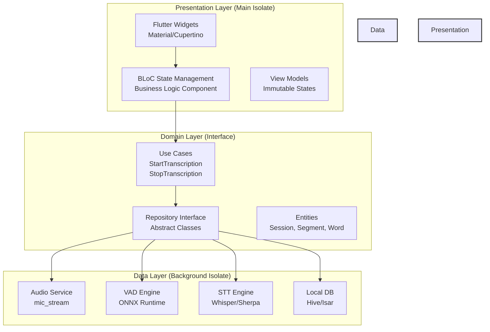
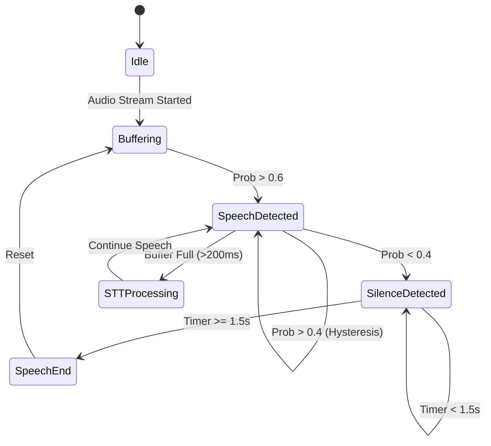
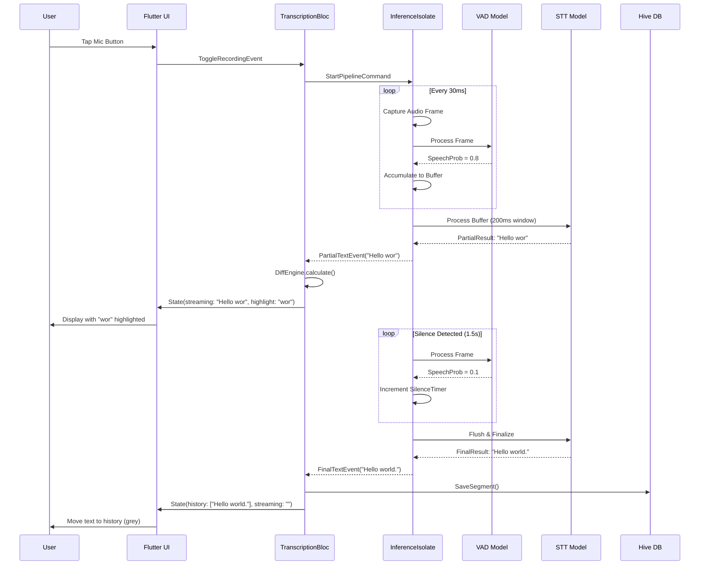
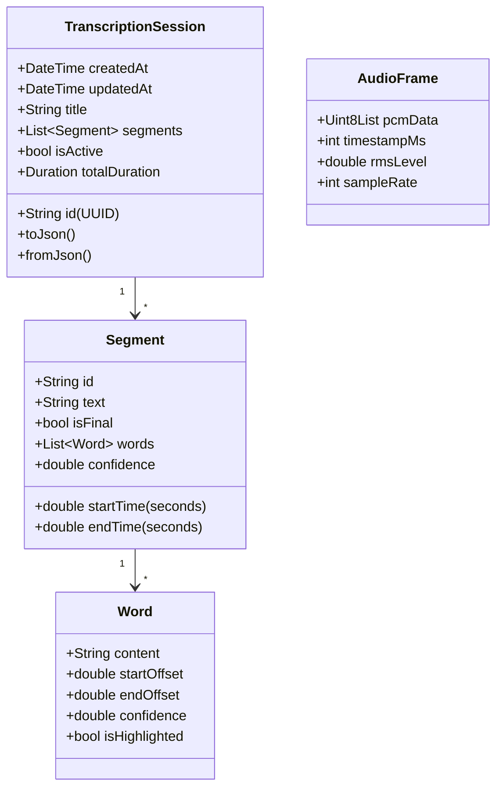
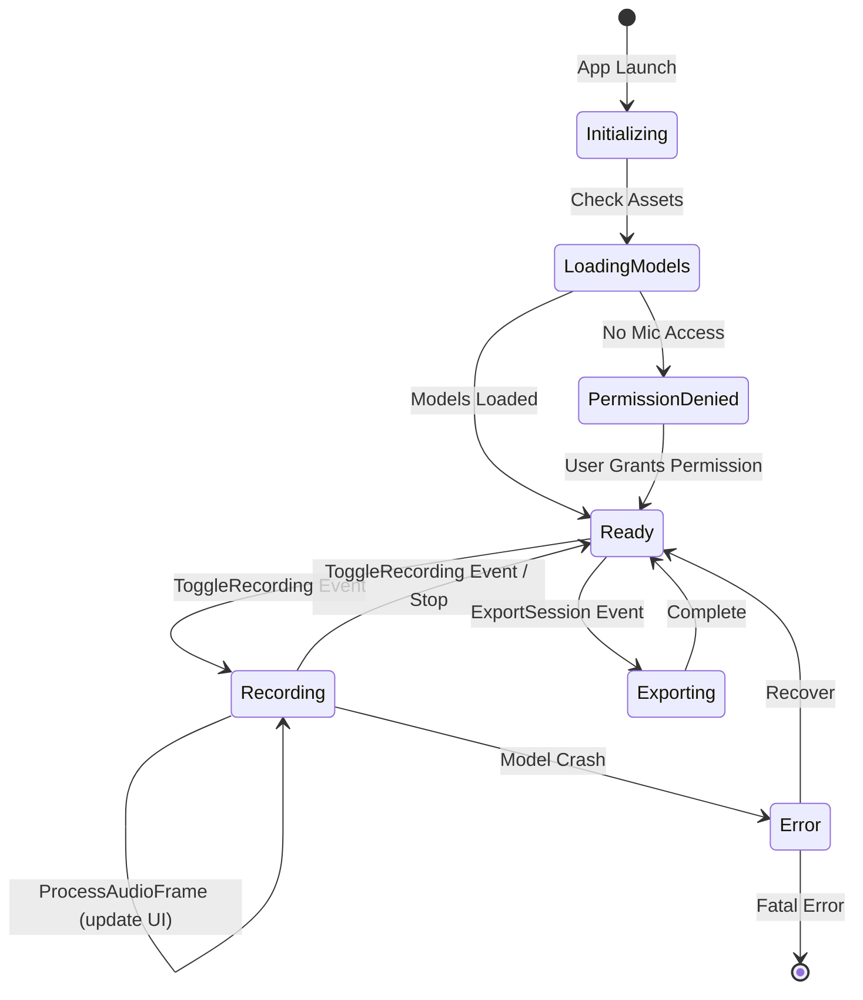
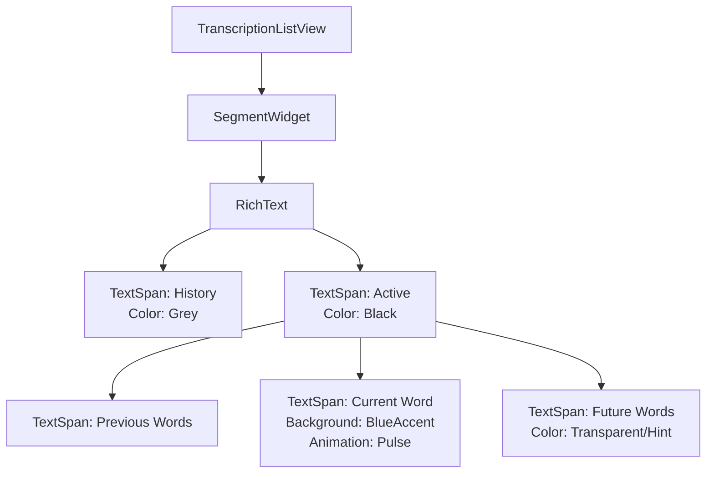
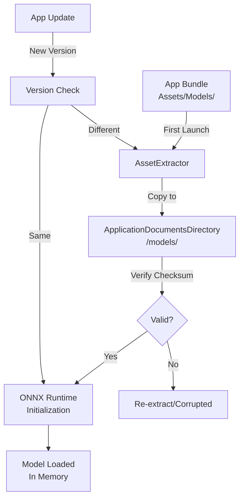

Here is the comprehensive **Technical Requirements Document (TRD)** for **LocalStream**, structured exactly per your specifications with detailed sub-points and technical diagrams.

---

# Technical Requirements Document (TRD)
**Project Name:** LocalStream  
**Version:** 1.0  
**Date:** January 2025  
**Platform:** Flutter (Android/iOS)  
**Classification:** Confidential

---

## 1. Executive Summary

**LocalStream** is a privacy-first, fully offline mobile application that performs real-time speech-to-text transcription with dynamic visual feedback. The application captures raw PCM audio from device microphones, processes it through a local Voice Activity Detection (VAD) neural network to segment speech, and streams the output through a quantized Whisper/Sherpa STT (Speech-to-Text) engine. 

The defining feature is the **"Textream" visualization engine**, which implements karaoke-style word highlighting and intelligent text diffing to handle partial recognition results without UI flicker. All processing occurs on-device within isolated compute threads, ensuring zero data egress and compliance with strict privacy requirements.

**Key Capabilities:**
- Real-time transcription latency < 300ms
- Offline operation (Airplane mode compatible)
- Automatic pause detection via Silero/Sherpa VAD
- Word-level timestamp tracking for precise highlighting
- Local persistence using Hive/Isar NoSQL database

---

## 2. System Overview

LocalStream operates as a **uni-directional data pipeline** with strict separation between I/O, inference, and presentation layers. The system ingests analog audio, digitizes it to PCM 16-bit format, filters silence using a lightweight VAD model (2MB), and feeds active speech segments to a quantized STT model (40-75MB). 

The architecture implements the **Producer-Consumer pattern** where the Audio Capture Service (Producer) emits frames to a Ring Buffer, consumed by the Inference Isolate. The UI layer receives immutable state updates via a reactive stream, ensuring the main thread remains unblocked during heavy matrix computations.

**Core Value Proposition:**
Traditional STT apps either require cloud connectivity or provide static "block" transcription. LocalStream provides continuous, streaming text with visual feedback loops that indicate recognition confidence in real-time, mimicking the visual experience of cloud-based solutions while maintaining complete data sovereignty.

---

## 3. Functional Requirements

### 3.1 Audio Capture & Preprocessing
*   **FR-001:** System shall capture raw audio from device microphone at **16kHz sample rate, 16-bit PCM, mono channel**.
*   **FR-002:** System shall implement real-time resampling if hardware natively provides 44.1kHz or 48kHz.
*   **FR-003:** System shall calculate RMS (Root Mean Square) audio levels for the visualizer widget.
*   **FR-004:** System shall request and manage `RECORD_AUDIO` runtime permissions with graceful degradation dialogs.

### 3.2 Voice Activity Detection (VAD)
*   **FR-005:** System shall load and execute a Silero VAD v4 or Sherpa VAD ONNX model locally.
*   **FR-006:** System shall analyze audio frames (30ms-50ms windows) and output speech probability scores (0.0 to 1.0).
*   **FR-007:** System shall implement **hysteresis logic**: 
    *   Trigger "Speech Start" when probability > 0.6 (configurable)
    *   Trigger "Speech End" when probability < 0.4 for duration > 1.5 seconds
*   **FR-008:** System shall discard audio buffers with speech probability < 0.3 to conserve battery.

### 3.3 Speech-to-Text (STT) Engine
*   **FR-009:** System shall execute Whisper Tiny (Quantized INT8) or Sherpa-ONNX streaming models entirely on-device.
*   **FR-010:** System shall process audio in sliding windows (200-500ms) during active speech.
*   **FR-011:** System shall emit **Partial Results** (intermediate, changing text) every 100-200ms.
*   **FR-012:** System shall emit **Final Results** (stable, punctuated text) upon receiving "Speech End" signal from VAD.
*   **FR-013:** System shall provide **word-level timestamps** with ±50ms accuracy for highlighting synchronization.

### 3.4 Text Processing & Highlighting
*   **FR-014:** System shall implement a diffing algorithm to compare consecutive partial results and identify changed/updated words.
*   **FR-015:** System shall maintain separation between:
    *   **History:** Committed sentences (immutable)
    *   **Active Stream:** Current partial sentence (mutable)
    *   **Active Word:** Specific token currently being recognized (highlighted)
*   **FR-016:** System shall support smooth transitions when words are corrected (e.g., "cat" → "cap" → "cat") without jarring text jumps.

### 3.5 Data Persistence & Export
*   **FR-017:** System shall auto-save transcription sessions to local Hive/Isar database every 5 seconds or on significant pause.
*   **FR-018:** System shall store metadata: Session ID (UUID), timestamp, duration, word-level transcript.
*   **FR-019:** System shall export transcripts as `.txt` (plain text) and `.json` (with timestamps) files to device storage.
*   **FR-020:** System shall implement clipboard copy functionality for selected text segments.

---

## 4. Non-Functional Requirements

### 4.1 Performance & Latency
*   **NFR-001:** End-to-end latency (speech uttered to text displayed) shall not exceed **500ms** on mid-tier devices (Snapdragon 7xx / iPhone 11 equivalent).
*   **NFR-002:** UI frame rate shall maintain **60 FPS** during transcription; inference shall occur in background isolates.
*   **NFR-003:** Application cold start time (tap to ready) shall be < 3 seconds including model initialization.
*   **NFR-004:** Memory footprint shall not exceed **400MB** RAM during active transcription to prevent iOS jetsam termination.

### 4.2 Privacy & Security
*   **NFR-005:** **Zero Network:** Application shall function in Airplane Mode; no internet permission required for core functionality.
*   **NFR-006:** Audio buffers shall be zeroed out (memory wiped) immediately after processing to prevent forensic recovery.
*   **NFR-007:** Exported files shall be written to app-private storage; sharing via Android Sharesheet/iOS UIActivityViewController only.

### 4.3 Battery & Thermal
*   **NFR-008:** VAD shall act as a gatekeeper; STT model shall not execute during silence periods to reduce CPU utilization by ~60%.
*   **NFR-009:** Continuous transcription shall not drain battery > 15% per hour on devices with > 3000mAh capacity.
*   **NFR-010:** Application shall throttle inference frequency if thermal state reaches `.serious` (iOS) or `THERMAL_STATUS_SEVERE` (Android).

### 4.4 Accuracy & Robustness
*   **NFR-011:** Word Error Rate (WER) for clean speech shall be < 15% using Tiny Whisper model.
*   **NFR-012:** System shall handle device rotations, backgrounding (iOS), and split-screen multitasking without dropping audio streams.
*   **NFR-013:** Application shall recover gracefully from model inference crashes (Isolate restart capability).

---

## 5. System Architecture

The architecture follows **Clean Architecture** principles with **Hexagonal Ports & Adapters** pattern, ensuring the domain logic remains agnostic of Flutter/UI concerns.

### 5.1 Layer Structure



### 5.2 Concurrency Model

```ascii
┌─────────────────────────────────────────────────────────────┐
│                     MAIN ISOLATE (UI)                       │
│  ┌─────────────┐    ┌──────────────┐    ┌──────────────┐   │
│  │   Widgets   │◄───│  BLoC/Cubit  │◄───│  Repository  │   │
│  └─────────────┘    └──────────────┘    └──────┬───────┘   │
└─────────────────────────────────────────────────┼───────────┘
                                                  │
                                                  │ SendPort
                                                  ▼
┌─────────────────────────────────────────────────────────────┐
│                  INFERENCE ISOLATE (Heavy CPU)              │
│  ┌──────────────┐    ┌──────────────┐    ┌──────────────┐  │
│  │ Audio Buffer │───►│  VAD Check   │───►│  STT Decode  │  │
│  │  (Ring Buf)  │    │ (ONNX Model) │    │ (ONNX Model) │  │
│  └──────────────┘    └──────────────┘    └──────┬───────┘  │
└───────────────────────────────────────────────────┼──────────┘
                                                    │
                                                    │ Stream
                                                    ▼
                                            ┌──────────────┐
                                            │  Text Events │──► Back to Main Isolate
                                            └──────────────┘
```

---

## 6. Component Design

### 6.1 Audio Capture Service (ACS)

**Responsibility:** Hardware abstraction for microphone access and raw PCM stream generation.

**Specifications:**
*   **Input:** Hardware microphone (Android AudioRecord / iOS AVAudioEngine)
*   **Output:** `Stream<AudioFrame>` where `AudioFrame` = `{Uint8List data, int timestamp, double rms}`
*   **Buffering:** Implements circular ring buffer (size: 5 seconds of audio) to handle backpressure if STT inference temporarily lags.

**Diagram:**
```ascii
Hardware Mic ──► Platform Channel ──► AudioCaptureService
                                            │
                                            ▼
                                    ┌───────────────┐
                                    │  Resampler    │ (44.1→16kHz if needed)
                                    └───────┬───────┘
                                            │
                                            ▼
                                    ┌───────────────┐
                                    │ RMS Calculator│───► Visualizer Stream
                                    └───────┬───────┘
                                            │
                                            ▼
                                    ┌───────────────┐
                                    │ Output Stream │───► VAD Gate
                                    └───────────────┘
```

### 6.2 VAD Gate Controller

**Responsibility:** State machine managing speech/silence transitions and STT triggering.

**State Machine:**


**Logic:**
*   Maintains two timers: `SpeechTimer` (continuous speech duration) and `SilenceTimer` (gap detection).
*   Emits `SegmentBoundary` events to STT engine.

### 6.3 STT Inference Engine

**Responsibility:** ONNX model execution and text generation.

**Pipeline:**
1.  **Preprocessor:** Convert PCM Int16 → Float32 → Mel Spectrogram (if using Whisper) or direct feature extraction (if using Sherpa).
2.  **Inference:** Run ONNX session with `runForModel` call.
3.  **Postprocessor:** Decode token IDs to text, extract word timestamps.
4.  **Stream Controller:** Emit `TranscriptionEvent` objects.

**Optimization:** Uses `flutter_isolate` or `compute()` to prevent blocking UI thread during matrix multiplication.

### 6.4 Text Diffing & Highlighting Engine (TDHE)

**Responsibility:** Calculate visual differences between partial results to enable smooth UI updates.

**Algorithm:**
```dart
// Pseudo-logic
diff(previous: "Hello world", current: "Hello worlwide") {
  // Find common prefix: "Hello worl"
  // Identify changed suffix: "d" → "wide"
  // Return: stable="Hello worl", active="wide", highlightIndex=2
}
```

**Output:** `RenderingInstruction` object containing:
*   `stableText` (immutable, grey color)
*   `activeText` (changing, black color)
*   `highlightIndex` (specific word to animate)

---

## 7. Data Flow Diagrams

### 7.1 End-to-End Transcription Flow



### 7.2 Audio Processing Pipeline Detail

```ascii
┌────────────────────────────────────────────────────────────────┐
│                     AUDIO PIPELINE                             │
├────────────────────────────────────────────────────────────────┤
│                                                                │
│  Mic ──► [ADC] ──► PCM 16-bit ──► [Resampler] ──► 16kHz      │
│                                     │                          │
│                                     ▼                          │
│                              ┌────────────┐                    │
│                              │   VAD      │                    │
│                              │  (ONNX)    │                    │
│                              └─────┬──────┘                    │
│                                    │ Prob > 0.6                 │
│                                    ▼                            │
│                              ┌────────────┐                    │
│                              │  Speech?   │──── No ───► Drop   │
│                              └─────┬──────┘                    │
│                                    │ Yes                        │
│                                    ▼                            │
│                              ┌────────────┐                    │
│                              │  Ring      │                    │
│                              │  Buffer    │                    │
│                              └─────┬──────┘                    │
│                                    │ Every 200ms                │
│                                    ▼                            │
│                              ┌────────────┐                    │
│                              │    STT     │                    │
│                              │  (ONNX)    │                    │
│                              └─────┬──────┘                    │
│                                    │ Text + Timestamps          │
│                                    ▼                            │
│                              ┌────────────┐                    │
│                              │  Event     │                    │
│                              │  Stream    │──────► UI          │
│                              └────────────┘                    │
│                                                                │
└────────────────────────────────────────────────────────────────┘
```

---

## 8. Data Models

### 8.1 Core Entity Hierarchy



### 8.2 State Objects (BLoC)

```dart
// Immutable State Classes
abstract class TranscriberState {}

class TranscriberInitial extends TranscriberState {}

class TranscriberLoading extends TranscriberState {
  final double progress; // 0.0 to 1.0 (model loading)
}

class TranscriberReady extends TranscriberState {
  final bool hasPermission;
}

class TranscriberRecording extends TranscriberState {
  final List<Segment> history;
  final String activeText;
  final int activeWordIndex;
  final double audioLevel; // 0.0 to 1.0 for visualizer
  final bool isSpeaking; // VAD status for indicator
}

class TranscriberError extends TranscriberState {
  final String message;
  final bool isRecoverable;
}
```

---

## 9. State Management Design

### 9.1 BLoC Pattern Implementation

**Selected Pattern:** `flutter_bloc` (Cubit for simple features, Bloc for complex streams)

**Architecture:**
```mermaid
graph LR
    subgraph "UI Layer"
        W[Widgets]
        BC[BlocConsumer/Listener]
    end
    
    subgraph "Business Logic Layer"
        E[Events]
        B[TranscriptionBloc]
        S[States]
    end
    
    subgraph "Data Layer"
        Repo[TranscriptionRepository]
        DS[Data Sources]
    end
    
    W -->|add(event)| B
    B -->|emit(state)| W
    B -->|call| Repo
    Repo -->|fetch/update| DS
    
    style B fill:#f96,stroke:#333,stroke-width:2px
```

### 9.2 Event Definitions

| Event | Payload | Description |
|-------|---------|-------------|
| `InitializeApp` | None | Copy models from assets, check permissions |
| `RequestPermission` | None | Trigger system permission dialog |
| `ToggleRecording` | None | Start or stop transcription session |
| `ProcessAudioFrame` | `AudioFrame` | Internal: New audio data from isolate |
| `UpdatePartialText` | `String text, List<Word> words` | Stream update from STT |
| `FinalizeSegment` | `Segment segment` | VAD detected end of speech |
| `ExportSession` | `String sessionId, Format format` | Trigger export logic |
| `DeleteSession` | `String sessionId` | Remove from database |

### 9.3 State Transition Diagram



---

## 10. User Interface Design

### 10.1 Screen Layout Specification

**Main Transcription Screen:**
```
┌─────────────────────────────────────────┐
│ Status Bar (Time, Battery)              │
├─────────────────────────────────────────┤
│ ┌─────────────────────────────────────┐ │
│ │  Waveform Visualizer (Canvas)       │ │  <-- Height: 120dp
│ │  ═══════╤════════════╤═══════      │ │
│ └─────────────────────────────────────┘ │
│                                         │
│ ┌─────────────────────────────────────┐ │
│ │  Transcription ListView             │ │
│ │  ─────────────────────────────      │ │
│ │  Previous text... (Grey)            │ │
│ │  More history... (Grey)             │ │
│ │                                     │ │
│ │  Current sentence (Black)           │ │
│ │  word word [HIGHLIGHTED] word       │ │  <-- Active word blue bg
│ │                                     │ │
│ └─────────────────────────────────────┘ │
│                                         │
│ ┌─────────────────────────────────────┐ │
│ │  Controls                           │ │
│ │  [Settings] [●REC] [Export]         │ │  <-- FAB style or bar
│ └─────────────────────────────────────┘ │
└─────────────────────────────────────────┘
```

### 10.2 Visualizer Widget Logic

**Implementation:** CustomPainter receiving audio RMS levels.

```dart
class WaveformPainter extends CustomPainter {
  final List<double> amplitudes; // Length: 50-100 samples
  final Color color;
  
  @override
  void paint(Canvas canvas, Size size) {
    // Draw bars based on amplitudes
    // Color intensity based on VAD state (Green=Speech, Grey=Silence)
  }
}
```

### 10.3 Highlighting Implementation Strategy

**Widget Structure:**


**Animation Specification:**
*   **Current Word:** `AnimatedContainer` with `BoxDecoration` background color transitioning from transparent to `Colors.blue.withOpacity(0.3)` over 200ms.
*   **Text Updates:** Use `AnimatedSwitcher` or manual diffing to prevent rebuild flicker.

---

## 11. Model & Asset Management

### 11.1 Asset Lifecycle



### 11.2 Model Specifications

| Model | Format | Size | Purpose | Source |
|-------|--------|------|---------|--------|
| Silero VAD v4 | ONNX | ~2.1 MB | Speech detection | Silero GitHub |
| Whisper Tiny (INT8) | ONNX | ~39 MB | Speech recognition | HuggingFace |
| Sherpa ONNX | ONNX | ~25-80 MB | Alternative STT | Kaldi/Sherpa |

**Optimization Strategies:**
*   **Quantization:** Use INT8 quantized models to reduce memory by 4x vs FP32.
*   **Dynamic Shapes:** Configure ONNX runtime to handle variable input lengths (audio chunks).
*   **Memory Mapping:** Load models via `mmap` on iOS to reduce RAM footprint.

### 11.3 Versioning & Updates
*   Store model version in `SharedPreferences` / `NSUserDefaults`.
*   Hash verification (SHA-256) of model files on startup to detect corruption.
*   Support for model hot-swapping via settings (if multiple models bundled).

---

## 12. Platform Considerations

### 12.1 Android Specifics

**Permissions:**
*   `android.permission.RECORD_AUDIO` (Runtime permission required)
*   `android.permission.WRITE_EXTERNAL_STORAGE` (for Android < 10 export)
*   `android.permission.FOREGROUND_SERVICE` (if implementing background recording)

**Audio Implementation:**
*   Use `audio_streamer` or `flutter_sound` with `PCM` codec.
*   **Threading:** Ensure audio callbacks run on a dedicated thread via `android.os.Process.setThreadPriority(Process.THREAD_PRIORITY_URGENT_AUDIO)`.

**Background Execution:**
*   Android O+ requires `ForegroundService` with persistent notification to keep mic active when screen is off.
*   Battery optimization whitelisting prompt recommended.

### 12.2 iOS Specifics

**Permissions:**
*   `NSMicrophoneUsageDescription` (Required string in Info.plist)
*   `NSBluetoothAlwaysUsageDescription` (if supporting Bluetooth headsets)

**Audio Session Management:**
*   Configure `AVAudioSession` with category `.playAndRecord` and mode `.default` or `.spokenAudio`.
*   Handle interruptions (phone calls) via `AVAudioSessionDelegate` to pause/resume recording gracefully.

**Memory Constraints:**
*   iOS jetsam (memory pressure killer) is aggressive. Monitor `didReceiveMemoryWarning`.
*   Use `autoreleasepool` when processing large audio buffers in platform channels.

### 12.3 Cross-Platform Challenges

| Challenge | Mitigation |
|-----------|------------|
| Sample Rate Mismatch | Implement resampler (e.g., `soxr` or simple linear interpolation) |
| Buffer Sizes | Abstract platform-specific buffer sizes (Android: 640 bytes, iOS: varies) |
| Isolate Communication | Use `SendPort`/`ReceivePort` with binary data transfer (not JSON for audio) |

---

## 13. Development Phases

### Phase 1: Foundation (Week 1) - Audio & VAD
**Objective:** Raw audio flowing through VAD with visual feedback.

*   **Day 1:** Project scaffolding, dependency injection setup (`get_it`), folder structure (`lib/features/transcription`).
*   **Day 2:** Implement `AudioCaptureService` with platform channel abstraction. Verify PCM data integrity.
*   **Day 3:** Build real-time waveform visualizer using `CustomPainter` and RMS calculation.
*   **Day 4:** Integrate Silero VAD ONNX model. Create FFI bindings or use `sherpa_onnx` plugin.
*   **Day 5:** Implement VAD State Machine (Idle/Speaking/Silence) with console logging.
*   **Milestone:** App shows green indicator when speaking, red when silent, with smooth waveform.

### Phase 2: Intelligence (Week 2) - STT Integration
**Objective:** Text appearing on screen, segmented by pauses.

*   **Day 1:** Asset management system (model download/copy/verification).
*   **Day 2:** Integrate Whisper/Sherpa ONNX. Run inference on static audio file first.
*   **Day 3:** Wire VAD output to STT input (only process audio when VAD indicates speech).
*   **Day 4:** Implement partial result streaming from Isolate to Main Thread.
*   **Day 5:** Basic text display in ListView. Handle sentence finalization on silence detection.
*   **Milestone:** Speak into app, see text appear in chunks separated by pauses.

### Phase 3: Visualization (Week 3) - Highlighting & UI
**Objective:** Karaoke-style word highlighting and smooth animations.

*   **Day 1:** Design and implement `TextDiffingEngine` with word-tokenization logic.
*   **Day 2:** Build `RichText` composer that separates stable vs. active text spans.
*   **Day 3:** Implement word-level highlighting with `AnimatedContainer` background transitions.
*   **Day 4:** Handle "corrections" (when STT changes its mind mid-sentence) gracefully.
*   **Day 5:** Add auto-scroll logic and history visualization (greyed out previous sentences).
*   **Milestone:** Words highlight blue as spoken, smooth transitions, no flickering.

### Phase 4: Persistence & Polish (Week 4) - Storage & Release
**Objective:** Production-ready app with data persistence.

*   **Day 1:** Integrate Hive/Isar database. Schema design for Session/Segment/Word.
*   **Day 2:** Implement save/load logic. Auto-save every 5 seconds.
*   **Day 3:** Export functionality (TXT/JSON) using `share_plus` and `path_provider`.
*   **Day 4:** UI theming (Dark/Light mode), settings screen (VAD sensitivity slider).
*   **Day 5:** Performance profiling (DevTools), memory leak testing, release build signing.
*   **Milestone:** App survives rotation, saves sessions, exports files, works offline indefinitely.

---

## 14. Risk Assessment

| Risk ID | Description | Probability | Impact | Mitigation Strategy |
|---------|-------------|-------------|--------|---------------------|
| R01 | **Model Load Failure** - ONNX runtime fails to initialize on specific device architectures (x86 emulator, old ARM). | Medium | High | Provide multiple model formats (CPU vs NNAPI). Implement graceful "Model Not Supported" dialog with fallback to cloud (optional) or manual input. |
| R02 | **Audio Buffer Overflow** - STT inference slower than real-time causing memory accumulation. | Medium | High | Implement backpressure: drop oldest frames if buffer > 5s. Use faster Tiny model on slow devices. |
| R03 | **VAD False Positives** - Background noise (keyboard typing, AC) triggers transcription. | High | Medium | Allow user-adjustable VAD threshold in settings. Implement high-pass filter (remove <80Hz) before VAD. |
| R04 | **iOS Memory Kill** - Jetsam terminates app during long transcription due to RAM usage. | Medium | High | Aggressive memory management: dispose of audio buffers immediately after use. Monitor `applicationDidReceiveMemoryWarning`. Limit concurrent isolates. |
| R05 | **Permission Denial** - User denies microphone access permanently. | Low | High | Pre-permission education screen explaining offline privacy. Deep link to Settings if permanently denied. |
| R06 | **Thread Starvation** - UI thread blocked by heavy JSON serialization of transcript. | Low | Medium | Use binary codecs or protobuf for Isolate communication. Keep JSON serialization in background isolate only. |
| R07 | **Model Accuracy** - Whisper Tiny produces hallucinations (repetition, wrong words) in noisy environments. | High | Medium | Implement repetition detection logic. Allow user to manually edit text (future feature). |

---

## 15. Testing Strategy

### 15.1 Unit Testing
**Scope:** Business logic, algorithms, state machines.

*   **Test Cases:**
    *   VAD Gate state transitions (Silence → Speech → Silence).
    *   Text diffing algorithm (Levenshtein distance or custom implementation).
    *   Audio buffer ring buffer implementation (overflow handling).
    *   Word timestamp parsing from STT output.

**Tools:** `flutter_test`, `mockito` (for repository mocking), `bloc_test` (for state management).

### 15.2 Integration Testing
**Scope:** Feature workflows, database interactions, model inference.

*   **Test Cases:**
    *   Full pipeline: Feed pre-recorded `.wav` file through AudioService → VAD → STT → verify output text matches expected transcript.
    *   Database persistence: Create session → kill app → relaunch → verify data integrity.
    *   Export functionality: Generate file → verify existence and content format.

**Tools:** `integration_test` package, `flutter drive`.

### 15.3 Device Testing (Manual & Automated)
**Scope:** Performance, thermal, real-world accuracy.

*   **Scenarios:**
    *   **Coffee Shop Test:** Background noise with multiple speakers. Verify VAD filters others.
    *   **Battery Test:** 1-hour continuous transcription. Verify < 15% drain and no thermal throttling.
    *   **Interruption Test:** Receive phone call during recording. Verify pause/resume works.
    *   **Rotation Test:** Rotate device mid-sentence. Verify no audio drop or state loss.
    *   **Low Memory Test:** Run with other heavy apps in background. Verify no crash.

**Metrics to Capture:**
*   Latency (ms) from speech to text display.
*   Word Error Rate (WER) against ground truth test set.
*   CPU usage % (Android Profiler / Xcode Instruments).
*   Memory footprint (MB) over time.

### 15.4 Security/Privacy Testing
*   Verify no network packets sent (Charles Proxy / Wireshark monitoring).
*   Verify exported files contain no metadata beyond text/timestamps.
*   Verify clipboard cleared after sensitive operations (if applicable).

---

## 16. Glossary

| Term | Definition |
|------|------------|
| **BLoC** | Business Logic Component - A state management pattern that separates presentation from business logic using Events and States. |
| **FFI** | Foreign Function Interface - Mechanism for Dart code to call C/C++ libraries directly, used for ONNX runtime integration. |
| **Isolate** | Dart's implementation of threads with separate memory heaps, used to run CPU-intensive AI models without freezing the UI. |
| **Mel Spectrogram** | Visual representation of audio frequencies over time, used as input features for Whisper models. |
| **ONNX** | Open Neural Network Exchange - Open format for machine learning models allowing cross-platform deployment. |
| **PCM** | Pulse Code Modulation - Uncompressed raw digital audio format (16-bit integers in this context). |
| **Quantization** | Process of converting model weights from 32-bit floating point to 8-bit integers, reducing size by 75% with minimal accuracy loss. |
| **RMS** | Root Mean Square - Mathematical calculation of audio volume/power used for visualizers. |
| **STT** | Speech-to-Text - The process of converting spoken audio into written text using machine learning. |
| **VAD** | Voice Activity Detection - Algorithm (neural or heuristic) that detects presence of human speech vs. silence/noise. |
| **WER** | Word Error Rate - Metric calculated as (Substitutions + Insertions + Deletions) / Total Words in reference text. |
| **Hysteresis** | Logic technique using different thresholds for entering vs. exiting a state (e.g., start speaking at 0.6, stop at 0.4) to prevent rapid toggling. |
| **Ring Buffer** | Circular data structure used to temporarily store audio frames before processing, optimizing memory usage. |